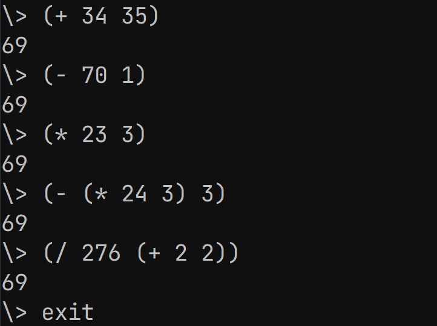

# Sexpr
A REPL to evaluate mathematical s-expressions written in C. In the future, it might be expanded to be a simple lisp interpereter or something similar.



## Quickstart

Build: 
```
make
```
Run: 
```
rlwrap ./sexpr
```
If rlwrap is unavailable, it is not required (just run `./sexpr`). It just adds arrow-key functionality to the REPL. 
